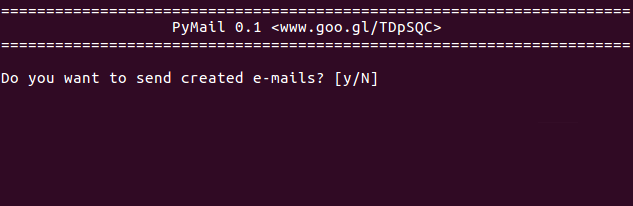

# [][1] PyMail

Programa totalmente desenvolvido em Python 2.7.x destinado ao envio de 
mala direta digital. Ou seja, o envio de e-mails padronizados e
personalizado para um grande número de pessoas, podendo anexar diferentes
arquivos para cada destinatário.

<p align="center">
  
</p>

## Como funciona?

O usuário cria uma planilha com as informações de cada destinatário, um
arquivo com o corpo do e-mail a ser enviado e um arquivo *\*.ini* que
contém as informações básicas para o envio.

Ao arrastar o arquivo *\*.ini* para o arquivo *PyMail.py* o programa é
inicializado, gerando uma página *html* para a visualização dos e-mails
criados.

Após a verificação destes e-mails, o usuário pode dar proseguimento ao envio
digitando a senha da conta de e-mail. Durante o envio dos e-mails é exibido 
uma barra de progresso. Ao enviar todos os e-mails criados, o programa é finalizado.

Essa é uma das formas que o PyMail pode ser utilizado. A outra seria
incorporá-lo em códigos pessoais como se fosse um módulo.


## 1. Instalação

A instalação do PyMail tem como dependência o Python 2.7.x. A sua 
instalação resume-se ao download do projeto que pode ser realizado através
do botão [**Download**][2] ou utilizando o comando git:

```sh
git clone https://github.com/bismarckjunior/PyMail.git
```


## 2. Execução

O PyMail pode ser utilizado de três maneiras: (1) como um script, através
do terminal ou (2) arrastando e soltando; e (3) como um módulo, criando
seus próprios scripts. Nas duas primeiras opções é fundamental o arquivo
de inicialização (*\*.ini*) que reune as principais informações necessárias
para o envio dos e-mails. Na execução pelo terminal, o arquivo *\*.ini* é
utilizado como argumento de entrada do script *PyMail.py*.

> Um duplo clique sobre o arquivo *PyMail.py* irá procurar por um
> arquivo *\*.ini* de exemplo para executar.

### 2.1. Terminal

Para executar a partir de um terminal, basta dirigir-se para a pasta onde
o script *PyMail.py* está localizado. Por exemplo, no Linux seria:

    $ cd PyMail/src

Em seguida, executar o script *PyMail.py* seguido do arquivo de inicialização:

    $ python PyMail.py ../examples/Email.ini

Ao realizar o comando acima, o PyMail entra em execução, exibindo o cabeçalho
do programa e iniciando o verificador de e-mails. 

|  |
|:----------------------------------------:|
| Início de execução do PyMail             |

|    |
|:--------------------------------------------------------:|
| Coletânea dos e-mail gerados pelo verificador de e-mails |

Após checar os e-mails criados o usuário pode dar continuidade ao envio dos
e-mails ou abortar o envio, finalizando o programa.

|  |
|:------------------------------------:|
| Final de execução do PyMail          |

### 2.2. Arrastando e Soltando

A execução através do processo de arrastar o arquivo *\*.ini* e soltar sobre o arquivo *PyMail.py* depende do sistema operacional. E é uma alternativa a execução via terminal, realizando os mesmos passos desta: exibe o cabeçalho, inicia o verificador de e-mails e finaliza o programa.

#### Windows

Para executar o simulador arrastando e soltando, no Windows, basta arrastar o arquivo de entrada *\*.ini* para o script *PyMail.py*.

Caso o Windows não permita soltar um arquivo sobre um arquivo *\*.py*, é 
necessário alterar algumas variáveis de registro do Windows. Para isso, faça
o download do arquivo [Python27.reg](files/Python27.reg), salve com a extensão *\*.reg* e 
execute-o.

#### Linux

Para usuários Linux, é necessário criar um arquivo *PyMail.desktop*, conforme
o exemplo abaixo.

```text
[Desktop Entry]
Type=Application
Terminal=true
Exec=python ~/Documentos/Git/PyMail/src/PyMail.py
Name=PyMail
```

Em seguida, deve-se tornar o script *PyMail.py* e o arquivo *PyMail.desktop*
executáveis, realizando o comando:

	$ chmod +x PyMail.* 

Finalmente, basta arrastar o arquivo de entrada para o arquivo
*PyMail.desktop*.

### 2.3. Criando Scripts

O PyMail também pode ser utilizado como um módulo Python, podendo ser 
incorporado em programas ou scripts desenvolvidos pelo usuário. Para isso, 
basta colocar a pasta do projeto PyMail no mesmo local do script e importar o
módulo PyMail.

Assim, um script *Email.py* deve seguir o seguinte esquema de localização:

```
 L Email.py
 L PyMail
    L examples
    L figs
    L src
       L PyMail.py
       : ...
```

Um exemplo de script em Python (*Email.py*) utilizando o módulo PyMail seria:

```python
from PyMail import PyMail

mail = PyMail(user="pymail@pymail.com", username="PyMail", password="1234#")
mail.send_mail(to="teste1@pymail.com",  # Destinatário
               msg="Oi, como vai?",     # Corpo do e-mail
               subject="Olá",           # Assunto do e-mail
               cc="",                   # Com cópia para...
               bcc="",                  # Com cóṕia oculta para ...
               attachs=["bomDia.png"])  # Anexos
```


## 3. Tipos de Arquivos

Os principais tipos de arquivos que o PyMail utiliza são: (1) arquivos de
inicialização (*\*.ini*); (2) arquivos de informações dos destinatários 
(*\*.csv*); (3) arquivos de mensagem (*\*.txt* e *\*.html*).

### 3.1. Arquivo INI 

O arquivo *\*.ini* possui as informações básicas para o envio dos e-mails 
em massa: (1) e-mail do remetente; (2) arquivo (*txt* ou *html*) com o corpo 
do e-mail; (3) arquivo (*csv*) com os dados dos destinatários; e (4) a senha
necessária para logar na conta de e-mail. A senha é uma informação opcional 
e caso não seja informada será requisidada no momento do envio dos e-mails.

Um exemplo de arquivo *\*.ini* é o arquivo 
[example_1.ini](examples/example_1/example_1.ini):

```text 
[Settings]
user     = "pymail@gmail.com"   # E-mail do remetente 
username = "PyMail"             # Nome do remetente
msg_file = "example_1.txt"      # Arquivo com o corpo do e-mail
csv_file = "example_1.csv"      # Arquivo com os dados dos destinatários
password = "1234#"              # [Opicional] Senha da conta do e-mail
```

### 3.2. Arquivo CSV

O arquivo *"\*.csv"* contém as informações dos destinatários. Este arquivo
é uma planilha na qual as colunas são delimitadas pelo caracter <kbd>;</kbd>. 
Na primeira linha é inserido as palavras-chave que são utilizadas para 
personalizar cada e-mail e nas linhas seguintes, para cada coluna, seus
respectivos valores. Os arquivos *\*.csv* são facilmente editáveis por 
editores de planilha eletrônica como o Excel (Microsoft Office) e o Calc 
(Libreoffice).

Abaixo está exemplificada uma planilha com as palavras-chave "E-mail", 
"Cc", "Equipe", "Data" e "Unidade" com os valores preenchidos:

| E-mail            | Cc                | Equipe             | Data       | Unidade  |
| ----------------- | ----------------- | ------------------ | ---------- | -------- |   
| teste1@pymail.com | suporte@pymail.com| Segue em Frente    | 11/02/2019 | Botafogo |
| teste2@pymail.com | suporte@pymail.com| Concentração Total | 22/09/2018 | Gávea    |
| teste3@pymail.com | suporte@pymail.com| Atitude Pura       | 04/07/2019 | Flamento |
| teste4@pymail.com | suporte@pymail.com| Força e Foco       | 17/08/2018 | Tijuca   |

Esta planilha é representada pelo arquivo 
[example_2.csv](examples/example_2/example_2.csv), dado por:

```text
E-mail;Cc;Equipe;Data;Unidade
teste1@pymail.com;suporte@pymail.com;Segue em Frente;11/02/2019;"Botafogo"
teste2@pymail.com;suporte@pymail.com;Concentração Total;22/09/2018;"Gávea"
teste3@pymail.com;suporte@pymail.com;Atitude Pura;04/07/2019;"Flamento"
teste4@pymail.com;suporte@pymail.com;Força e Foco;17/08/2018;"Tijuca"
```

Nesta planilha foram utilizadas algumas palavras-chave pré-definidas e 
outras personalizadas (ex: "Equipe", "Data" e "Unidade"), ou seja, 
criada pelo usuário.

As palavras-chave pré-definidas estão expostas na tabela abaixo onde apenas
a palavra-chave "E-mails" é obrigatória. O usuário pode criar quantas
palavras-chave além das pré-definidas. Essas palavras-chave poderão ser
utilizadas no corpo do e-mail que estará descrito no arquivo *\*.txt* ou
*\*.html* a depender do tipo de mensagem a ser enviada.

| Palavras-chave | Descrição                                   |
|:---------------|:--------------------------------------------|
| E-mails\*      | E-mail do destinatário                      |
| Cc             | Com cópia para (*carbon copy*)              |
| Bcc            | Com cópia oculta para (*blind carbon copy*) |
| Subject        | Assunto do e-mail                           |
| Attachments    | Anexos do e-mail, separados por ";"         |

> \* Palavra-chave obrigatória.

### 3.3. Arquivo TXT e HTML

O corpo do e-mail a ser enviado deve ser escrito em um arquivo *\*.txt*, 
para o uso de texto sem formatação, ou *\*.html*, no qual as funcionalidades
*html* estarão disponíveis. Nestes arquivos o uso das palavras-chave 
delimitado pelos caracteres <kbd></kbd> substitui a palavra-chave pelo
respectivo valor na planilha de informações (arquivo *\*.csv*).

Um exemplo de arquivo *\*.txt*, contendo apenas o corpo do e-mail, é o arquivo
[example_1.txt](examples/example_1/example_1.txt):

```text
Prezad{{Nome(Artigo)}} {{Nome}},

  Você já possui {{Valor}} na sua conta e deve retirá-lo até o dia {{Retirada}}.

  Segue em anexo o seu extrato.
  
At.te,
PyMail
```

Também é possível inserir o assunto do e-mail na primeira linha do arquivo
*\*.txt*. Para isso basta iniciar o arquivo com o texto "Subject:". Desta
forma, é possível personalizar o assunto do e-mail com as informações na
planilha de informações (arquivo *\*.csv*).

Um exemplo de arquivo *\*.txt*, contendo o assunto e o corpo do e-mail, 
é o arquivo [example_2.txt](examples/example_2/example_2.txt):

```text
Subject: Equipe {{Equipe}} - Apresente-se!

Prezada Equipe {{Equipe}},

Já chegou o tão esperado momento. 

Pedimos para que se apresentem no dia {{Data}} na unidade {{Unidade}}.

Atenciosamente,
PyMail
```

Outra possibilidade é o uso de comandos *html* no corpo do e-mail. Para isso,
ao invés de um arquivo *\*.txt* deve-se utilizar um arquivo *\*.html*. 

Um exemplo de arquivo *\*.html* é o arquivo
[example_3.html](examples/example_3/example_3.html):

```text
Subject: Festa Top!
Oi {{Nome}},
<br><br>
Na nossa festinha do dia 22/09, você <b>deverá</b> levar:

<h3 style="text-indent: 40px">{{Quantidade}} de {{Produto}}</h3>

Lembrem-se que o produto deve:
<ul>
    <li> Ser de qualidade </li>
    <li> Estar dentro da validade</li>
    <li> Ser armazenado em {{Armazenamento}} </li>
</ul>

Abraços, <br>
PyMail
```

Para poder visualizar os e-mails na forma como serão enviados, existe a
possibilidade de usar o verificador de e-mails. Que será discutido na 
próxima seção.


## 4. Verificador de E-mails

O verificador de e-mail é uma funcionalidade criada para visualizar todos os
e-mails criados pelo PyMail antes de enviá-los. Desta forma, o usuário pode
conferir se os e-mail foram criados corretamente para cada destinatário.

Essa verificação é realizada através de um navegador de internet (Chrome,
Firefox, Internet Explorer...), onde o usuário pode navegar entre os e-mails
gerados, conforme a figura abaixo.

|    |
|:--------------------------------------------------------:|
| Coletânea dos e-mail gerados pelo verificador de e-mails |


## 5. Licença

O PyMail está disponível sob a licença Apache 2.0. Para mais informações
leia o arquivo [LICENSE](LICENSE).


[1]: https://github.com/bismarckjunior/PyMail
[2]: https://github.com/bismarckjunior/PyMail/archive/master.zip
